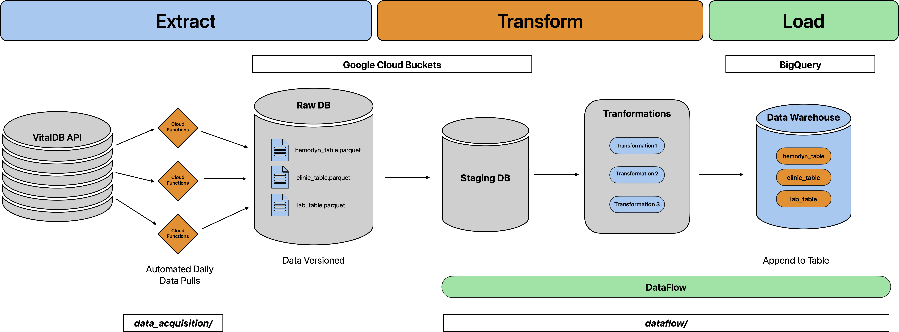

# AC215 - Milestone 2 - DoseWise

#### Project Milestone 2 Organization

```
├── README.md
├── data_acquisition
│   ├── clinic_table
│   │   ├── main.py
│   │   └── requirements.txt
│   ├── hemodyn_table
│   │   ├── main.py
│   │   └── requirements.txt
│   ├── lab_table
│   │   ├── main.py
│   │   └── requirements.txt
|-- dataflow
│   ├── core_clinic.py
│   ├── core_hemodyn.py
```

# Milestone 2

**Team Members:**
Kaylee Vo, Chloe Seo, Adrian Sarno

**Group Name:** 
DoseWise

**Project**
DoseWise is a project that analyzes patient vitals and outputs predictions based on a given drug dossage. It provides an LLM interface that allows users to query patient data, receiving summaries of patient history. The interface also allows users to input a drug dosage and receive predictions on how the patient's vitals will change given an action. Our model provides predictions with and without the drug dosage, allowing users to see the impact of the drug on patient vitals.

### Milestone2 ###

In this milestone, we built out an entire data pipeline that is versioned and automated. We also have two models in containers that can be deployed to a cloud service. The first model is a encoder-decoder model that takes in patient vital time series and outputs two time series: one with the drug dosage and one without. The second model is a LLM that takes in a user query and outputs a summary of the patient's clinical history. 

## Data Pipeline Overview

**Data** For MS2, we gather data for 103 patients from the VitalDB database. The 103 patients were patients with data for ART, ECG_II, PLETH, CO2, and PHEN_RATE, which represent arterial pressure wave, ecg lead II wave, plethysmography wave, capnography wave, and phenylephrine infusion rate with a concentration of 100 mcg/mL, respectively. For the 103 patients, since the data is very high frequency, the shape of the data is around 1.8 million rows and 6 columns, the additional column is the patient ID. A time column was added in the extraction process.

### Data Pipeline Containers

#### 1. Extraction

We utlize Google Cloud Functions to extract data from the VitalDB database and load it into Google Cloud Storage buckets. We call this our **Raw DB**. The code snippets below show how we deploy the cloud functions.

```python
gcloud functions deploy export_hemodyn_to_gcs \
  --runtime python311 \
  --trigger-http \
  --allow-unauthenticated \
  --memory=2GB \
  --timeout=1200 \
```

We provide arguments and a `requirements.txt` file to specify the runtime environment for the cloud functions. We automate the data pulls using Cloud Scheduler. The data is stored as parquet files in timestamped partitions, as folders in the GCS bucket. Timestamping folders is our current data versioning method but can be improved in the future.

The three scripts for the cloud functions can be found in the `data_acquisition` folder.

#### 2. Transformation

We use Google Cloud Dataflow as our main tool for data transformation and orchestration. We use Apache Beam and Flink to write our data transformation code. As our container, we pull from the `apache/beam_python3.11_sdk` image and add our own code and `requirements.txt` file. The code for the Dataflow job can be found in the `dataflow/` folder. We include a `tests/` folder for testing using `"DirectRunner"`. It is a form of integration testing to ensure that the code will work in the cloud environment prior to deployment.

The Dataflow job first copies the raw data into a staging area in GCS. It then executes the python code to perform cleaning and preprocessing, and writes the cleaned data into a table in BigQuery, which is our Data Warehouse. Writes are done using append mode. Jobs can be executed as

```python
python core_hemodyn.py
```

An example DAG of the Dataflow job is shown below:


#### 3. Loading

The cleaned data is stored in a BigQuery table. We use BigQuery as our data warehouse for its scalability and ease of use with other GCP services. The cleaned data is stored in a table called `hemodyn_table` in the `dosewise` dataset. The schema of the table can be found in each of the Dataflow scripts.

Finally, a full diagram of our ETL (extract, transform, load) pipeline is shown below:


